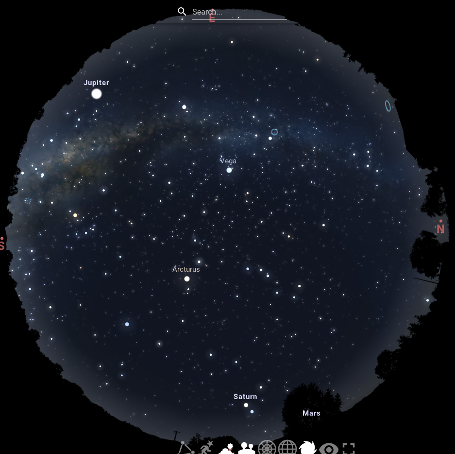
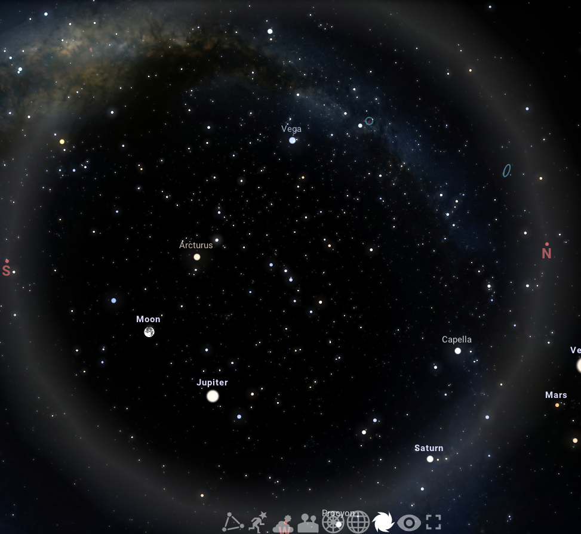

<h1 align="center">Stellarium Python Library</h1>

[Stellarium Website](https://stellarium-web.org/)

## Python

1. SIMPLE SOLAR SYSTEM:

- The format and transformations are just for presentation purposes and are not a part of the algorithm.
- Using pandas library for convenience. The initial values and final output are python standard dictionaries.
- Used values are valid for J2000 epoch (2000-01-01 noon) and will deviate from actual positions the more distant is chosen date.
- Pluto added to make nice contrast with its inclined orbit
- Rates of parameters change added for testes which are valid between 1950 - 2050 year.

2. ADDITIONAL FUNCITONALITIES:

- conversion between different reference frames
- comparison with observational data
- barycenter movment for orbits. May be used for out-of-ordinary orbits (see example at the Bonus section). Not very useful for realistic situations due to negligible effect on planetary systems, but can be used to produce something like this: https://www.youtube.com/watch?v=0jHsq36_NTU
- sub orbits cann be attached to orbits. Sub orbits are itself orbtis so can have their own sub orbits. Only limitation is that all than orbit names in one systems should be unique.

## Solidity

Convert the Orbit python library to solidity.